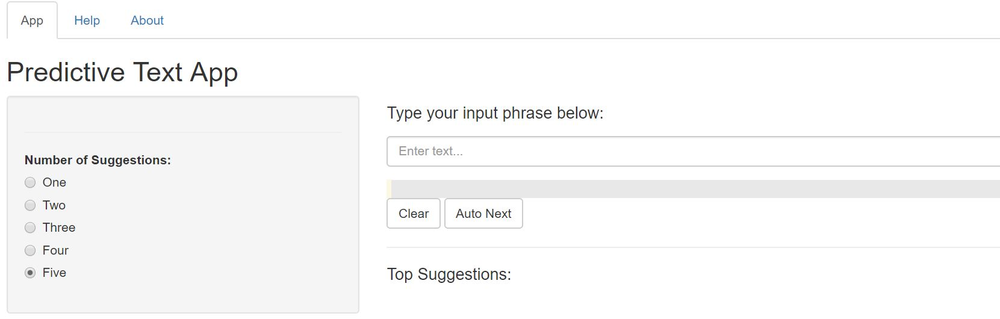
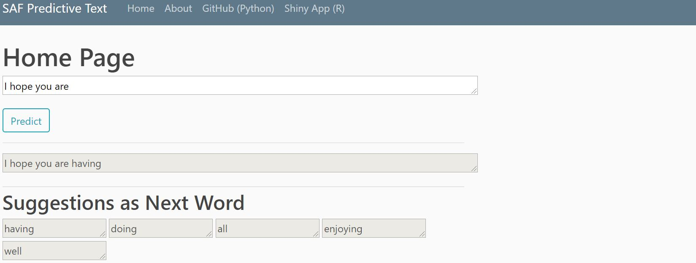

# Predictive Text Web Application (Python Flask, R Shiny)
This is a web-based application (implemented in both R and Python programming languages) suggesting words the end user may wish to insert in a text field. The current report describes the technical aspect of the product.

The following two figures show the home pages of the [R Shiny App](https://asafilian.shinyapps.io/as_txtpredict) and the [Python Flask App](http://saf-predictivetext.us-east-2.elasticbeanstalk.com/)

I analyzed a large corpus of text documents (4,269,678 lines, and over 102,080,244 words) to discover the relationship between words. The observations are gathered from News, Blogs, and Twitter.

One of the main challenges in this project was the limited computational resources (memory and time). We need to find the right balance between size and runtime in order to provide a good experience to the user. To this end, I tried several models.

I evaluated the quality (precision, average runtime, and memory consumption) of our models by scripts and a test data (1,392 lines and 28,658 words). The top-3 precision of my model tuned out to be about 22%.

The following preprocessing/cleaning were performed on the data:
- lower-case conversion 
- removing hyphens 
- removing separators (white-spaces) 
- removing punctuations 
- removing numbers 
- removing profanities 
- removing non-English words 

I then extracted uni-grams (words), bi-grams (two consecutive words), tri-grams (three consecutive words), ..., hexa-grams (six consecutive words) from the clean data, and analyzed them. I performed some exploratory analysis to understand the distributions of term frequencies in n-grams. Next, I built an n-gram model to predict next words given a phrase. To further optimize the memory usage, I performed several more preprocessing tasks on n-grams.

I followed the Backoff method5 in building the model. That is, to predict the next word, the app first uses the hexa-gram probability. If it does not have enough of a hexa-gram count to make it, it backs off and uses the 5-gram probability. If there still is not enough of a 5-gram count, it uses the quad-gram probability. It continues until it gets some appropriate suggestions or it gets some random words from the most frequent words in the uni-grams probability table. To calculate the n-gram probabilities, I used the Kneser-Ney smoothing method.

This project was implemented in two languages Python and R. I used R Shiny and Python Flask to implement their web-based application. The applications and sources can be found in the following links:
- **R**:
	+ [Application](https://asafilian.shinyapps.io/as_txtpredict): Implemented with R Shiny and deployed into [shinyapps.io](https://www.shinyapps.io/).  
	+ [Technical Report](https://rpubs.com/asaf/shiny_predictive_text)
	+ [GitHub Repository](https://github.com/asafilian/Predictive_Text_Shiny_App)
- **Python**:
	+ [Application](http://saf-predictivetext.us-east-2.elasticbeanstalk.com/): Implemented with Flask and deployed into [AWS](https://aws.amazon.com/).
	+ [GitHub Repository](https://github.com/asafilian/Flask-Text-Predictive-App)
